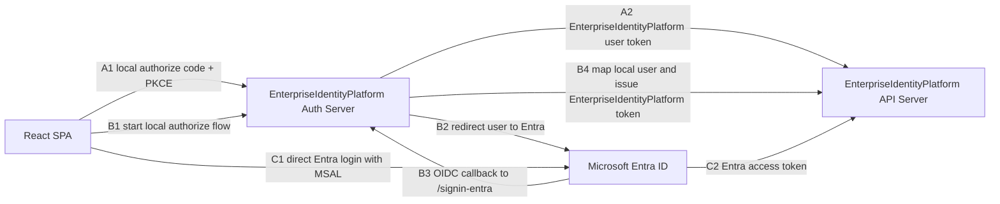
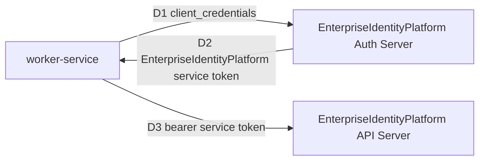
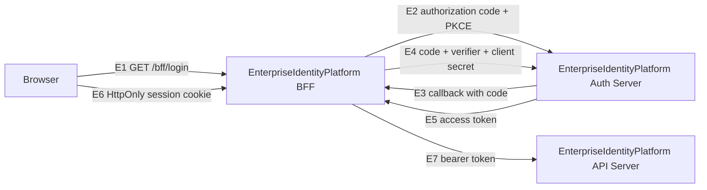

# EnterpriseIdentityPlatform

EnterpriseIdentityPlatform is a full-stack identity and authorization system built with ASP.NET Core and React. It implements a custom OAuth2/OIDC authorization server from scratch, protected resource APIs, browser-based login, service-to-service access, Microsoft Entra ID integration, federated SSO, and a BFF token-handling model.

The architecture mirrors common enterprise identity boundaries: authentication, token issuance, JWT validation, scope/role authorization, external identity federation, browser session protection, and API access control.

## Capabilities

- From-scratch Auth Server with OAuth2 authorization code + PKCE, client credentials, OIDC discovery, UserInfo, and JWKS.
- Federated SSO from the Auth Server to Microsoft Entra ID.
- API Server that accepts both local Auth Server JWTs and direct Entra ID access tokens.
- BFF backend that stores user access tokens server-side and exposes an HttpOnly session cookie to the browser.
- React SPA with local login, Auth Server SSO login, direct Entra login, logout, token inspection, and claims inspection.
- Authorization policies for user scopes, roles, service tokens, and API keys.
- RSA-backed JWT signing with public-key discovery through JWKS.
- Backend tests, frontend build verification, Docker support, and `.http` request collections.

## Login Modes

| Mode | Flow | Token Used By API | Permission Source |
| --- | --- | --- | --- |
| Local Login | SPA -> Auth Server -> API | EnterpriseIdentityPlatform access token | Local `Auth:Users` + `Auth:Clients` |
| Auth Server SSO | SPA -> Auth Server -> Entra -> Auth Server -> API | EnterpriseIdentityPlatform access token | Entra identifies the user; Auth Server maps to local scopes/roles |
| Direct Entra Login | SPA -> Entra -> API | Entra access token | Entra API scopes such as `access_as_user` |
| Client Credentials | Service -> Auth Server -> API | EnterpriseIdentityPlatform service token | Registered local service client scopes |
| BFF Login | Browser -> BFF -> Auth Server -> BFF -> API | EnterpriseIdentityPlatform access token stored by BFF | Local `Auth:Users` + `demo-bff` client |

In the SSO flow, Entra ID only proves who the user is. EnterpriseIdentityPlatform still decides what the user can do by mapping the Entra username claim to a local user record and issuing first-party tokens with local scopes and roles.

Service-to-service access is modeled through the local Auth Server client-credentials flow. Entra ID is used for user federation and direct SPA login in this implementation.

## User Login Flow



The SPA has three user-facing options: local Auth Server login, Auth Server SSO through Entra, and direct Entra login. In the SSO path, Entra authenticates the user, but EnterpriseIdentityPlatform still issues the API token after local user mapping.

| Path | Steps | Result |
| --- | --- | --- |
| A. Local Login | A1 -> A2 | EnterpriseIdentityPlatform authenticates the user and issues an EnterpriseIdentityPlatform token. |
| B. Auth Server SSO | B1 -> B2 -> B3 -> B4 | Entra authenticates the user; EnterpriseIdentityPlatform maps local permissions and issues an EnterpriseIdentityPlatform token. |
| C. Direct Entra Login | C1 -> C2 | Entra issues the API token directly. |

## Service Flow



The worker-service path uses client credentials against the local Auth Server. It does not redirect to SSO and does not represent a signed-in user. API key access is also supported, but it is kept out of the main architecture flow because it is a separate non-OAuth authentication path.

## BFF Backend Flow



The BFF stores access tokens in a server-side in-memory session. The browser receives only `EnterpriseIdentityPlatform.Bff.Session`, an HttpOnly cookie containing a random session identifier. The SPA exposes a separate BFF login mode and routes read, claims, write, and UserInfo requests through the BFF. Write requests require an `X-CSRF-TOKEN` header obtained from the BFF session endpoint.

## Authorization Model

Local EnterpriseIdentityPlatform tokens use the `scope` claim:

- `content.read` allows read endpoints.
- `content.write` allows write endpoints.
- `Admin` role allows admin endpoints.
- `token_type=service` identifies client-credentials tokens.

Direct Entra tokens use Entra claims:

- `scp=access_as_user` allows read endpoints.
- `scp=write_as_user` can allow write endpoints if that scope is configured in Azure.

The direct Entra SPA configuration requests `access_as_user` for the read path. `write_as_user` can be enabled when the matching Azure API scope is created.

## Run

Docker:

```powershell
docker compose up --build
```

Docker with local private SSO settings:

```powershell
docker compose -f docker-compose.yml -f docker-compose.local.yml up -d --build
```

Local backend:

```powershell
dotnet run --project backend\EnterpriseIdentityPlatform.AuthServer\EnterpriseIdentityPlatform.AuthServer.csproj --urls http://localhost:5001
dotnet run --project backend\EnterpriseIdentityPlatform.ApiServer\EnterpriseIdentityPlatform.ApiServer.csproj --urls http://localhost:5002
dotnet run --project backend\EnterpriseIdentityPlatform.Bff\EnterpriseIdentityPlatform.Bff.csproj --urls http://localhost:5003
```

Local frontend:

```powershell
cd frontend\EnterpriseIdentityPlatform.Web
npm install
npm run dev
```

Open `http://localhost:5173`.

## Local Runtime Credentials

| Type | Identifier | Secret | Access |
| --- | --- | --- | --- |
| User | `user` | `user123` | `content.read` |
| User | `admin` | `admin123` | `content.read content.write`, `Admin` role |
| Client | `worker-service` | `worker-secret` | `content.read content.write` |
| SPA | `demo-spa` | none | `openid profile content.read content.write` |
| BFF | `demo-bff` | `bff-secret` | `openid profile content.read content.write` |
| API key | `internal-tool` | `dev-api-key-123` | `X-Api-Key` |

These credentials are for running the local stack. Production deployments should source secrets from managed secret storage and environment-specific configuration.

## Entra SSO Setup

Auth Server SSO requires a confidential web app registration in Microsoft Entra ID:

| Setting | Value |
| --- | --- |
| Redirect URI | `http://localhost:5001/signin-entra` |
| Authority | `https://login.microsoftonline.com/<tenant-id>/v2.0` |
| Client ID | Entra web app application ID |
| Client Secret | Store outside Git |

Configure local secrets with:

```powershell
dotnet user-secrets set "Auth:ExternalProviders:Entra:Enabled" "true" --project backend\EnterpriseIdentityPlatform.AuthServer
dotnet user-secrets set "Auth:ExternalProviders:Entra:Authority" "https://login.microsoftonline.com/<tenant-id>/v2.0" --project backend\EnterpriseIdentityPlatform.AuthServer
dotnet user-secrets set "Auth:ExternalProviders:Entra:ClientId" "<auth-server-web-app-client-id>" --project backend\EnterpriseIdentityPlatform.AuthServer
dotnet user-secrets set "Auth:ExternalProviders:Entra:ClientSecret" "<client-secret>" --project backend\EnterpriseIdentityPlatform.AuthServer
```

The Entra username claim, by default `preferred_username`, must match a local `Auth:Users[*].Username` value. That local user controls the final EnterpriseIdentityPlatform scopes and roles.

## Logout

The SPA `Logout` action clears local token state, removes the BFF token session, and calls Auth Server `/account/logout` to remove the server-side HttpOnly login cookie. Clearing only browser tokens is not enough because an existing Auth Server cookie can still issue a fresh authorization code.

## API Surface

| Endpoint | Authorization |
| --- | --- |
| `GET /content/public` | Anonymous |
| `GET /content/user` | Any valid bearer token |
| `GET /content/me` | Current authentication state and claims |
| `GET /content/admin` | `Admin` role |
| `GET /content/read` | Local `content.read` or Entra `access_as_user` |
| `POST /content/write` | Local `content.write` or Entra `write_as_user` |
| `GET /content/service` | `token_type=service` |
| `GET /content/api-key` | Valid `X-Api-Key` header |
| `GET /health` | Service health probe |

BFF endpoints:

| Endpoint | Purpose |
| --- | --- |
| `GET /bff/login` | Start BFF authorization-code login |
| `GET /bff/callback` | Exchange the authorization code server-side |
| `GET /bff/session` | Return BFF session status without exposing the access token |
| `GET /bff/content/read` | Proxy a read request to API Server |
| `GET /bff/content/me` | Proxy the API Server claims inspection request |
| `POST /bff/content/write` | Proxy a write request with `X-CSRF-TOKEN` validation |
| `GET /bff/userinfo` | Proxy the Auth Server UserInfo request |
| `POST /bff/logout` | Delete the BFF token session and HttpOnly cookie |

HTTP request examples are available in:

- `backend/EnterpriseIdentityPlatform.http`
- `backend/EnterpriseIdentityPlatform.AuthServer/EnterpriseIdentityPlatform.AuthServer.http`
- `backend/EnterpriseIdentityPlatform.ApiServer/EnterpriseIdentityPlatform.ApiServer.http`

## Verify

```powershell
dotnet test backend\EnterpriseIdentityPlatform.sln

cd frontend\EnterpriseIdentityPlatform.Web
npm run build
```

## Code Map

Auth Server:

- `backend/EnterpriseIdentityPlatform.AuthServer/Controllers/AccountController.cs` owns the login page, external login entry point, logout, and Auth Server cookie.
- `backend/EnterpriseIdentityPlatform.AuthServer/Controllers/ConnectController.cs` owns `/connect/authorize`, `/connect/token`, UserInfo, PKCE validation, scope checks, and code exchange.
- `backend/EnterpriseIdentityPlatform.AuthServer/Options/EntraExternalLoginOptions.cs` controls the configured Entra SSO provider.
- `backend/EnterpriseIdentityPlatform.AuthServer/Services/JwtService.cs` signs user, service, and ID tokens.

API Server:

- `backend/EnterpriseIdentityPlatform.ApiServer/Program.cs` configures local JWT validation, Entra JWT validation, API-key authentication, and authorization policies.
- `backend/EnterpriseIdentityPlatform.ApiServer/Controllers/ContentController.cs` defines the protected endpoint matrix.

Frontend:

- `frontend/EnterpriseIdentityPlatform.Web/src/auth.ts` handles PKCE, callback exchange, MSAL login, token acquisition, and logout state cleanup.
- `frontend/EnterpriseIdentityPlatform.Web/src/App.tsx` coordinates login state, API calls, claims inspection, and logout.
- `frontend/EnterpriseIdentityPlatform.Web/src/config.ts` centralizes local URLs, client ID, redirect URI, scopes, and storage keys.

BFF:

- `backend/EnterpriseIdentityPlatform.Bff/Controllers/BffController.cs` owns login, callback, session inspection, API proxies, CSRF validation, and logout.
- `backend/EnterpriseIdentityPlatform.Bff/Services/BffSessionStore.cs` stores temporary PKCE state and server-side token sessions in memory.
