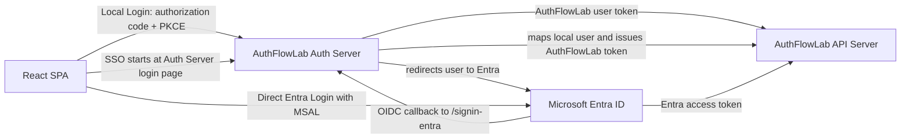
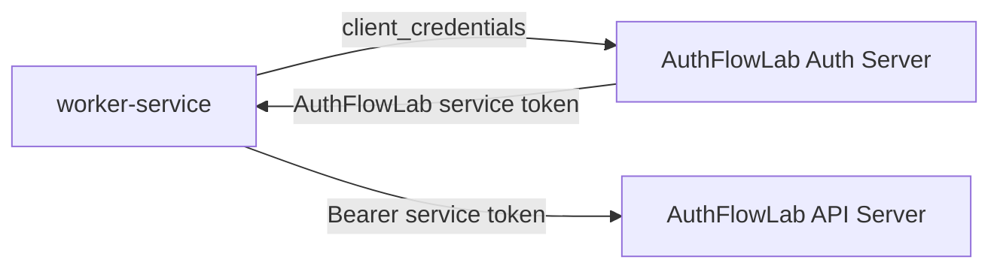

# AuthFlowLab

AuthFlowLab is a full-stack identity and authorization reference implementation built with ASP.NET Core and React. It demonstrates a custom OAuth2/OIDC authorization server, protected resource APIs, browser-based login, service-to-service access, Microsoft Entra ID integration, and federated SSO.

The project is designed to show how identity systems are typically split in enterprise applications: authentication, token issuance, JWT validation, scope/role authorization, external identity federation, and API protection.

## Capabilities

- Custom Auth Server with OAuth2 authorization code + PKCE, client credentials, OIDC discovery, UserInfo, and JWKS.
- Federated SSO from the Auth Server to Microsoft Entra ID.
- API Server that accepts both local Auth Server JWTs and direct Entra ID access tokens.
- React SPA with local login, Auth Server SSO login, direct Entra login, logout, token inspection, and claims inspection.
- Authorization policies for user scopes, roles, service tokens, and API keys.
- RSA-backed JWT signing with public-key discovery through JWKS.
- Backend tests, frontend build verification, Docker support, and `.http` request samples.

## Login Modes

| Mode | Flow | Token Used By API | Permission Source |
| --- | --- | --- | --- |
| Local Login | SPA -> Auth Server -> API | AuthFlowLab access token | Local `Auth:Users` + `Auth:Clients` |
| Auth Server SSO | SPA -> Auth Server -> Entra -> Auth Server -> API | AuthFlowLab access token | Entra identifies the user; Auth Server maps to local scopes/roles |
| Direct Entra Login | SPA -> Entra -> API | Entra access token | Entra API scopes such as `access_as_user` |
| Client Credentials | Service -> Auth Server -> API | AuthFlowLab service token | Registered local service client scopes |

In the SSO flow, Entra ID only proves who the user is. AuthFlowLab still decides what the user can do by mapping the Entra username claim to a local user record and issuing first-party tokens with local scopes and roles.

The current service-to-service path is local Auth Server only. This project does not configure an Entra client-credentials service client.

## User Login Flow



The SPA has three user-facing options: local Auth Server login, Auth Server SSO through Entra, and direct Entra login. In the SSO path, Entra authenticates the user, but AuthFlowLab still issues the API token after local user mapping.

## Service Flow



The worker-service path is local Auth Server only. It does not use Entra, does not redirect to SSO, and does not represent a signed-in user. API key access is also supported, but it is kept out of the main architecture flow because it is a separate non-OAuth authentication path.

## Authorization Model

Local AuthFlowLab tokens use the `scope` claim:

- `content.read` allows read endpoints.
- `content.write` allows write endpoints.
- `Admin` role allows admin endpoints.
- `token_type=service` identifies client-credentials tokens.

Direct Entra tokens use Entra claims:

- `scp=access_as_user` allows read endpoints.
- `scp=write_as_user` can allow write endpoints if that scope is configured in Azure.

The current direct Entra SPA configuration requests only `access_as_user` so the demo works even when the optional Azure `write_as_user` scope has not been created.

## Run

Docker:

```powershell
docker compose up --build
```

Docker with local private SSO settings:

```powershell
docker compose -f docker-compose.yml -f docker-compose.local.yml up -d --build
```

Local backend:

```powershell
dotnet run --project backend\AuthFlowLab.AuthServer\AuthFlowLab.AuthServer.csproj --urls http://localhost:5001
dotnet run --project backend\AuthFlowLab.ApiServer\AuthFlowLab.ApiServer.csproj --urls http://localhost:5002
```

Local frontend:

```powershell
cd frontend\AuthFlowLab.Web
npm install
npm run dev
```

Open `http://localhost:5173`.

## Test Identities

| Type | Identifier | Secret | Access |
| --- | --- | --- | --- |
| User | `user` | `user123` | `content.read` |
| User | `admin` | `admin123` | `content.read content.write`, `Admin` role |
| Client | `worker-service` | `worker-secret` | `content.read content.write` |
| SPA | `demo-spa` | none | `openid profile content.read content.write` |
| API key | `internal-tool` | `dev-api-key-123` | `X-Api-Key` |

These are development credentials for the local environment. Do not use committed secrets for production systems.

## Entra SSO Setup

Auth Server SSO requires a confidential web app registration in Microsoft Entra ID:

| Setting | Value |
| --- | --- |
| Redirect URI | `http://localhost:5001/signin-entra` |
| Authority | `https://login.microsoftonline.com/<tenant-id>/v2.0` |
| Client ID | Entra web app application ID |
| Client Secret | Store outside Git |

Configure local secrets with:

```powershell
dotnet user-secrets set "Auth:ExternalProviders:Entra:Enabled" "true" --project backend\AuthFlowLab.AuthServer
dotnet user-secrets set "Auth:ExternalProviders:Entra:Authority" "https://login.microsoftonline.com/<tenant-id>/v2.0" --project backend\AuthFlowLab.AuthServer
dotnet user-secrets set "Auth:ExternalProviders:Entra:ClientId" "<auth-server-web-app-client-id>" --project backend\AuthFlowLab.AuthServer
dotnet user-secrets set "Auth:ExternalProviders:Entra:ClientSecret" "<client-secret>" --project backend\AuthFlowLab.AuthServer
```

The Entra username claim, by default `preferred_username`, must match a local `Auth:Users[*].Username` value. That local user controls the final AuthFlowLab scopes and roles.

## Logout

The SPA `Logout` action clears local token state and calls Auth Server `/account/logout` to remove the server-side HttpOnly login cookie. Clearing only browser tokens is not enough because an existing Auth Server cookie can still issue a fresh authorization code.

## API Surface

| Endpoint | Authorization |
| --- | --- |
| `GET /content/public` | Anonymous |
| `GET /content/user` | Any valid bearer token |
| `GET /content/me` | Current authentication state and claims |
| `GET /content/admin` | `Admin` role |
| `GET /content/read` | Local `content.read` or Entra `access_as_user` |
| `POST /content/write` | Local `content.write` or Entra `write_as_user` |
| `GET /content/service` | `token_type=service` |
| `GET /content/api-key` | Valid `X-Api-Key` header |
| `GET /health` | Service health probe |

HTTP request examples are available in:

- `backend/AuthFlowLab.http`
- `backend/AuthFlowLab.AuthServer/AuthFlowLab.AuthServer.http`
- `backend/AuthFlowLab.ApiServer/AuthFlowLab.ApiServer.http`

## Verify

```powershell
dotnet test backend\AuthFlowLab.sln

cd frontend\AuthFlowLab.Web
npm run build
```

## Code Map

Auth Server:

- `backend/AuthFlowLab.AuthServer/Controllers/AccountController.cs` owns the login page, external login entry point, logout, and Auth Server cookie.
- `backend/AuthFlowLab.AuthServer/Controllers/ConnectController.cs` owns `/connect/authorize`, `/connect/token`, UserInfo, PKCE validation, scope checks, and code exchange.
- `backend/AuthFlowLab.AuthServer/Options/EntraExternalLoginOptions.cs` controls the optional Entra SSO provider.
- `backend/AuthFlowLab.AuthServer/Services/JwtService.cs` signs user, service, and ID tokens.

API Server:

- `backend/AuthFlowLab.ApiServer/Program.cs` configures local JWT validation, Entra JWT validation, API-key authentication, and authorization policies.
- `backend/AuthFlowLab.ApiServer/Controllers/ContentController.cs` defines the protected endpoint matrix.

Frontend:

- `frontend/AuthFlowLab.Web/src/auth.ts` handles PKCE, callback exchange, MSAL login, token acquisition, and logout state cleanup.
- `frontend/AuthFlowLab.Web/src/App.tsx` coordinates login state, API calls, claims inspection, and logout.
- `frontend/AuthFlowLab.Web/src/config.ts` centralizes local URLs, client ID, redirect URI, scopes, and storage keys.
